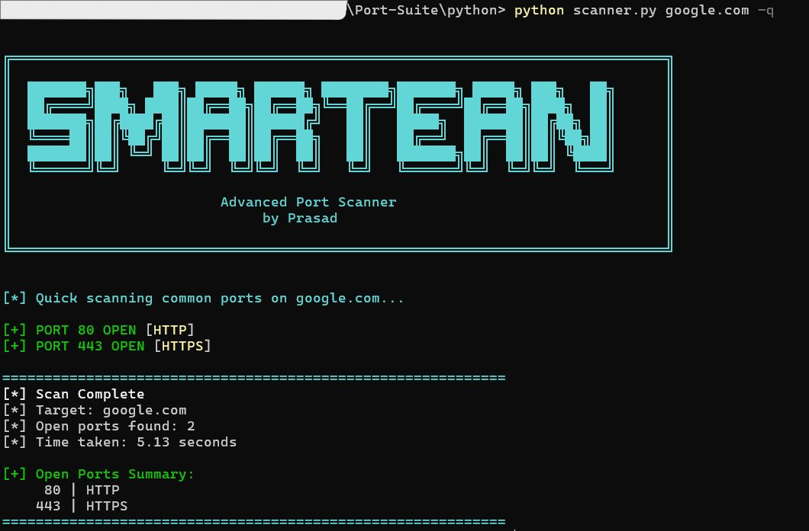
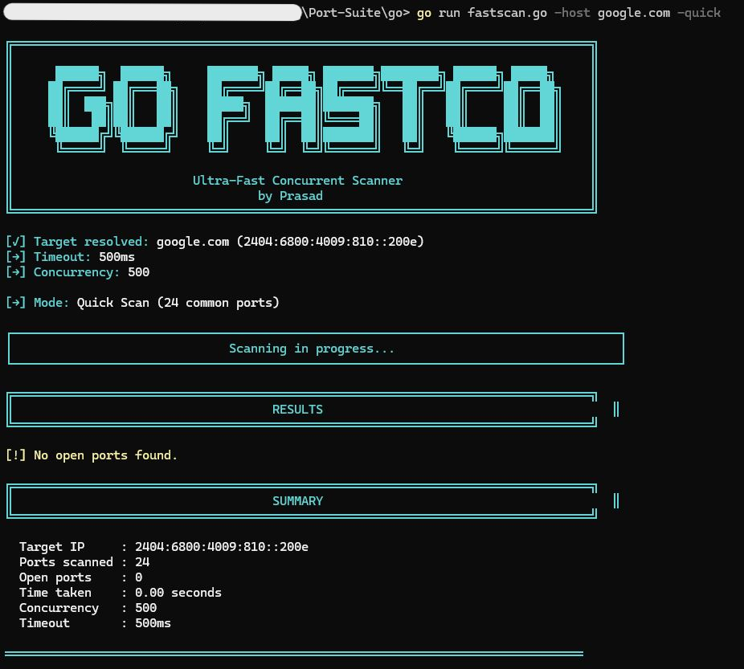
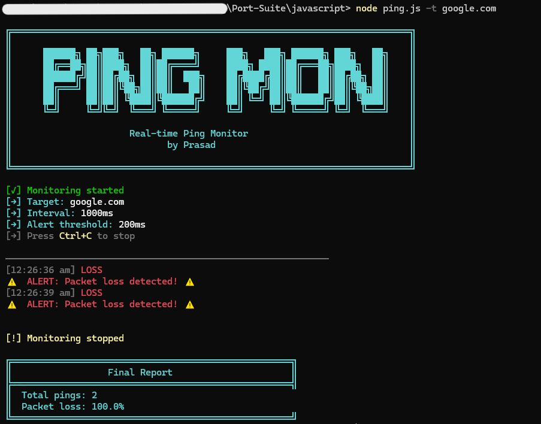
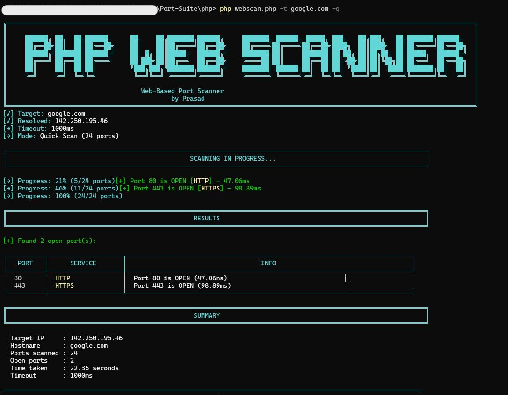
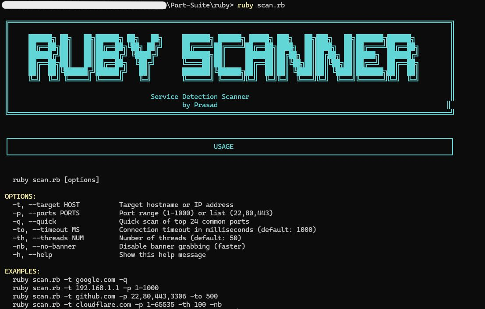

<div align="center">

```
                ██████╗  ██████╗ ██████╗ ████████╗    ███████╗██╗   ██╗██╗████████╗███████╗
                ██╔══██╗██╔═══██╗██╔══██╗╚══██╔══╝    ██╔════╝██║   ██║██║╚══██╔══╝██╔════╝
              ██████╔╝██║   ██║██████╔╝   ██║       ███████╗██║   ██║██║   ██║   █████╗
              ██╔═══╝ ██║   ██║██╔══██╗   ██║       ╚════██║██║   ██║██║   ██║   ██╔══╝
                ██║     ╚██████╔╝██║  ██║   ██║       ███████║╚██████╔╝██║   ██║   ███████╗
                ╚═╝      ╚═════╝ ╚═╝  ╚═╝   ╚═╝       ╚══════╝ ╚═════╝ ╚═╝   ╚═╝   ╚══════╝
```
**Port scanning and network analysis toolkit....built for performance and learning.**


</div>

---

## Advanced Scanner 

The most powerful scanner in this suite. Pure Python, zero dependencies.

```bash
python python/advanced_scanner.py -t scanme.nmap.org -p top1000
```

| Feature | Details |
|---|---|
| **Speed** | 300 threads — 1,000 ports in ~3 seconds |
| **Banner grabbing** | HTTP, SSH, FTP, SMTP, Redis, MySQL + more |
| **OS detection** | Fingerprints from banner patterns |
| **CVE hints** | 60+ port-specific vulnerability warnings |
| **Export** | `--json` · `--csv` · `--txt` |
| **Port expressions** | `top1000` · `all` · `1-1024` · `80,443` |
| **No dependencies** | Pure Python 3 stdlib |

```bash
# Fast scan
python python/advanced_scanner.py -t target.com -p top1000 --no-banner -T 500

# Stealth mode
python python/advanced_scanner.py -t target.com --stealth

# Export
python python/advanced_scanner.py -t target.com -p top1000 --json out.json
```

---

## Other Versions

| Used | Best For |
|---|---|
| Python (advanced) | Deep scanning |
| Go | Blazing fast |
| Rust | Memory-safe performance |
| Bash | Local network discovery |
| JavaScript | Real-time ping monitor |
| PHP | Web UI + CLI |
| C# | Windows GUI |
| Ruby | Service fingerprinting |

---

## Screenshots

### Advanced Scanner

> ⚠  Use only on systems you own or have permission to test....

### Go · JavaScript · PHP · Ruby
   

---

## ⚠️ Disclaimer

For educational purposes and authorized testing only. Only scan systems you own or have permission to test.

---

## Author

**Prasad**
